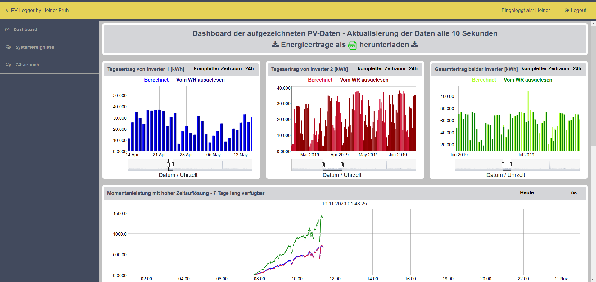

# pvlogger
Visualisierung von aufgezeichneten PV Daten mittels InfluxDB / Dygraphs / Django 



# InfluxDB installieren
```
wget https://dl.influxdata.com/influxdb/releases/influxdb_1.5.3_armhf.deb
sudo dpkg -i influxdb_1.5.3_armhf.deb
```
Automatisches Starten aktivieren, Starten und Status Checken
```
sudo systemctl enable influxdb
sudo systemctl start influxdb
sudo systemctl status influxdb
```

# Berryconda (python3) installieren
```
wget https://github.com/jjhelmus/berryconda/releases/download/v2.0.0/Berryconda3-2.0.0-Linux-armv7l.sh
chmod +x Berryconda3-2.0.0-Linux-armv7l.sh
./Berryconda3-2.0.0-Linux-armv7l.sh
```
Zum Ende der Installation wird gefragt ob der Pfad exportiert werden soll. Hier JA/YES angeben!

Benötigte python Packete installieren:
```
pip install Django==1.11.2 
pip install nginx 
pip install uwsgi
pip install pandas
pip install numpy
pip install django-widget-tweaks 
pip install python-django
pip install django-admin
pip install influxdb 
```


# nginx einrichten
```
sudo apt-get update
sudo apt-get install nginx
```
Den Ordner pvlogger (Hauptverzeichnis) nach /home/pi kopieren 
Aus dem Ordner "deployment" die Datei "pvlogger" nach /etc/nginx/sites-available/ kopieren (erfordet sudo)
Link erstellen:
```
sudo ln -s /etc/nginx/sites-available/pvlogger /etc/nginx/sites-enabled/pvlogger
```
Automatisches Starten aktivieren, Starten und Status Checken 
```
sudo systemctl enable nginx
sudo systemctl start nginx
sudo systemctl status nginx
```

# Django Projekt einrichten
Unter pvlogger/pvlogger/secret_settings.py das email Backend konfigurieren
```
cd /home/pi/pvlogger
python manage.py makemigrations
python manage.py migrate
python manage.py collectstatic
```

# uWSGI service einrichten
Aus dem Ordner "deployment" die Datei "pvlogger.service" nach /etc/systemd/system/ kopieren (erfordert sudo)
Automatisches Starten aktivieren, Starten und Status Checken
```
sudo systemctl enable pvlogger
sudo systemctl start pvlogger
sudo systemctl status pvlogger
```

Sobald am Django Projekt Änderungen vorgenommen werden muss uWSGI neugestartet werden:
```
sudo systemctl restart pvlogger
sudo systemctl status pvlogger
```